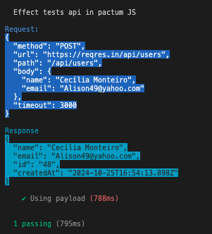

# PactumJs-JSON

## Efetauar testes em apis usando pactumJs apenas por JSONs

## Sumary

- [Introdução](#introdução)
  - [Instalação](#instalação)
  - [Configuração do Projeto](#configuraçãodoprojeto)
- [Uso](#uso)
  - [Save](#save)
  - [Expect](#expect)
  - [Schema](#schema)
  - [Post Payload](#payload)

## Introdução

```text
Neste repositório você consegue efetuar requisições e validações de API usando PactumJs, via JSONs.
```

### Instalação

```js
git clone https://github.com/JamesonBatista/pactumJs.request.in.json.git
npm i

npm test
```

### Configuração do Projeto

```text

#local do testes

/testes

#local dos jsons

/tests/json

#env.json onde ficará seus endpoints mais organizados

/env.json
```

## Uso

> crie um JSON na pasta `tests/json`

```json
{ "get": "https://reqres.in/api/users/2" }
```

```js
// no seu test
// aqui temos um get simples, de forma automática o código irá colocar o status como 200

import { request } from "../lib/index.js";

describe("Effect tests api in pactum JS", () => {
  it("Tests array tests", async () => {
    await request("tests/json/get.json");
  });
});
```

```json
// adicionando log você terá impresso a request e response da requisição
{ "get": "https://reqres.in/api/users/2", "log": true }
```


## Usando env

```text
Usando env você pode pegar o valor de um path completo ou uma parte e montar sua url.
 ** env.json **

```


```json
{ "get": "endpoint" }
```

```text
in test

console: npm test

```


```json
// in json
{ "get": "endpoint_part/users/2" }
```


## Save

```text
Você pode salvar dados de uma requisição para usar na próxima de maneira simples.
Adicionando um save você tem algumas formas de salvar

{save: "first_name"}
{save: {path: "first_name"}}

```

```json
{ "get": "https://reqres.in/api/users/2", "save": "first_name" }
```

```text
in test

console: npm test
```


## save multiple value

```json
// in JSON

{
  "get": "https://reqres.in/api/users/2",
  "save": [{ "path": "first_name" }, { "path": "last_name" }]
}
```


## Usando valores do save

```text
Sempre que você salvar um dado, seja id, name, ou qualquer, você pode usá-lo na próxima requisição.
O valor sempre será salvo com o nome do path.
O valor salvo pode ser usado em qualquer lugar do JSON, seja url, seja body, etc.

** Respeite sempre save: "id" -> {id} save: "name" -> {name} **
```

```json
//in json
{ "get": "https://reqres.in/api/users/2", "save": "id" }
```

```json
// in json
[
  { "get": "https://reqres.in/api/users/2", "save": "id" },
  { "get": "https://reqres.in/api/users/{id}" }
  // result "https://reqres.in/api/users/2"
]
```

## Expect

```text
Usando o expect você consegue efetuar validações se o o path exist ou se é igual A.

```

```json
// in json
{ "get": "https://reqres.in/api/users/2", "expect": "first_name" }
```

```text
in test

console: npm test
```


## Equal

```json
// in json
{
  "get": "https://reqres.in/api/users/2",
  "expect": [{ "path": "first_name", "eq": "Janet" }]
}
```


## Schema

```text
Para efetuar um teste de contrato ou schema, basta colar o eschema no JSON.

1 - você vai acessar https://www.liquid-technologies.com/online-json-to-schema-converter
2 - colar o JSON que quer criar o schema
3 - copiar  e criar o path schema no seu json e colar

```


## Payload

```json
{
  "post": "endpoint_part/users",
  "payload": { "name": "faker.name", "email": "faker.email" }
}
```




### gerar dados fakes

```json
    {
      "post": "endpoint_part/users",
      "payload": {
        "username": "admin",
        "password": "password",
        "name": "faker.name", // faker.nome
        "email": "faker.email",
        "enterprise": "faker.enterpriseName", // faker.empresaNome faker.entrerprise
        "state": "faker.state", // faker.estado
        "city": "faker.city", // faker.cidade
        "country": "faker.country", //faker.pais
        "street": "faker.street", // faker.endereco // faker.address // faker.rua
        "phoneNumber": "faker.phoneNumber", // faker.numeroTelefone
        "cep": "faker.cep",
        "cpf": "faker.cpf",
        "cnpj": "faker.cnpj",
        "passwords": "faker.password", //faker.senha
        "uuid": "faker.uuid",
        "birthdate": "faker.birthdate", // faker.aniversario
        "avatar": "faker.avatar",
        "professional": "faker.professional", // faker.profissao
        "product": "faker.product", // faker.produto
        "imagem": "faker.image", // faker.imagem
        "text": "faker.text", // faker.texto
        "title": "faker.title", // faker.titulo
        "actualDate": "faker.actualDate", // faker.dataAtual
        "futureDate": "faker.futureDate", // faker.dataFutura
        "fruta": "faker.fruta",
        "fruit": "faker.fruit",
        "object": "faker.object", // faker.objeto
        "num": "faker.number(12)", // 123484218445
        "number": "faker.number(7)", // 9713187


      },
    };

```
